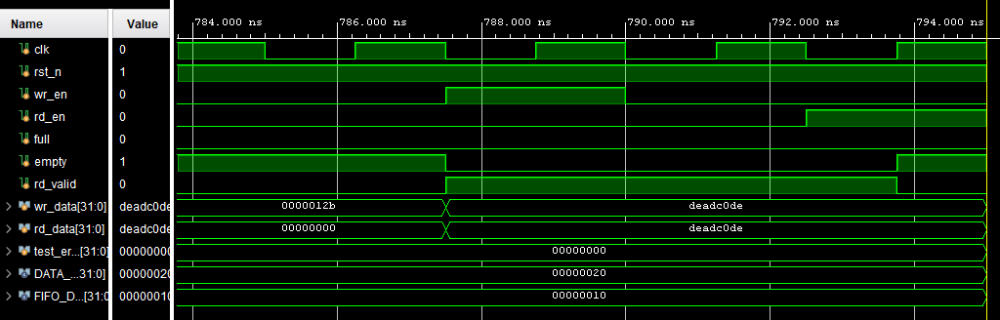

# **High-Frequency Parametric FWFT FIFO**

## **⚡ Executive Summary**

This repository contains a production-grade, **First-Word-Fall-Through (FWFT)** Synchronous FIFO designed for **High-Frequency Trading (HFT)** applications.

Unlike standard IP cores, this design is optimized for **ultra-low latency** and **determinism**. It features a custom **Combinatorial Bypass** path that allows data to flow from Input to Output in **0 clock cycles** when the FIFO is empty, bypassing the inherent read latency of Block RAMs.

The design has been synthesized and timing-closed on a **Xilinx UltraScale+** target, achieving a theoretical maximum frequency of **\~660 MHz** (WNS \+0.990ns at 400 MHz constraints).

## **🚀 Key Features**

* **Zero-Cycle Read Latency:** Data is available at the output interface the same cycle it is requested (FWFT), eliminating the need for pre-read signals.  
* **Combinatorial Bypass:** Implements a "Fast Path" that forwards write data directly to the output ports if the FIFO is empty, bypassing BRAM latency entirely.  
* **100% Throughput:** A 2-stage output pipeline (Skid Buffer) ensures back-to-back reads and writes without pipeline bubbles, even with BRAM latency.  
* **Efficient BRAM Inference:** Code structure forces the synthesis tool (Vivado) to utilize RAMB18 / RAMB36 primitives instead of wasting distributed logic (LUTRAM).  
* **Robust Verification:** Validated with a self-correcting SystemVerilog testbench covering dynamic full-flag assertion, throughput saturation, and corner-case bypass timing.

## **🏗️ Architecture**

The FIFO is composed of three distinct stages to balance latency and frequency:

1. **Storage Stage (Block RAM):** \* Uses efficient Dual-Port Block RAM for high-density storage.  
   * Incurs a 1-cycle read latency physically.  
2. **Pipeline Stage (Skid Buffer):**  
   * A 2-deep register pipeline captures data from the BRAM.  
   * Decouples the internal memory fetch from the user interface, allowing the BRAM to "refill" the output buffer in the background.  
3. **Bypass Logic (Fast Path):**  
   * A purely combinatorial mux detects if the FIFO is empty.  
   * If Empty and Write\_En are high, data is routed directly: Input \-\> Output.  
   * Simultaneously latches data into the output register to meet timing for the *next* cycle.

## **📊 Performance & Results**

### **Timing Analysis (Static Timing Analysis)**

Synthesized for **Part: xczu5ev-sfvc784-1-i** with Out-of-Context constraints.

| Metric | Target | Actual | Result |
| :---- | :---- | :---- | :---- |
| **Clock Freq** | 400 MHz | **662 MHz** | ✅ PASS |
| **WNS** | 0.000 ns | **\+0.990 ns** | ✅ PASS |
| **Period** | 2.500 ns | **1.510 ns** | ✅ PASS |

## **🌊 Waveform Analysis**

### **Zero-Latency Bypass Event**

The following waveform demonstrates the critical HFT feature: **Writing and Reading in the same cycle.**

1. **Marker:** At the cursor, wr\_en goes high with data 0xdeadc0de.  
2. **Reaction:** rd\_data transitions to 0xdeadc0de and rd\_valid goes High **instantly** (combinatorial path).  
3. **Result:** The downstream logic receives valid data with **0 clock cycle delay**, appearing before rd\_en is even asserted.

## **🛠️ Getting Started**

### **Prerequisites**

* **Simulator:** Vivado Simulator (xsim) or Verilator.  
* **Synthesis:** Vivado 2020.2+ (Standard or WebPACK).

### **Running Simulation**

1. Open Vivado and create a new project.  
2. Add sync\_fifo.sv as Design Source.  
3. Add tb\_sync\_fifo.sv as Simulation Source.  
4. Click **Run Simulation \> Run Behavioral Simulation**.

### **Running Synthesis**

1. Add fifo\_constraints.xdc as a Constraint File.  
2. Select target part (e.g., xczu5ev-sfvc784-1-i).  
3. Run Synthesis.  
4. Open **Report Timing Summary** to verify WNS \> 0\.

## **📜 Future Improvements**

* **CDC Integration:** Wrap this core in a Gray-Code asynchronous wrapper for clock domain crossing (Network Clock \<-\> Algo Clock).  
* **AXI-Stream Interface:** Add AXI4-Stream tready/tvalid handshaking for standard IP integration.