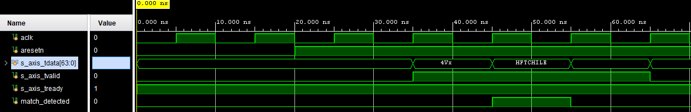

# Zero-Latency AXI-Stream Pattern Matcher

## Executive Summary
This project implements a **combinatorial 64-bit header parser** designed for High-Frequency Trading (HFT) ingress pipelines. It monitors an AXI4-Stream bus and asserts a trigger signal within **0 clock cycles** (combinatorial path) upon detecting a specific market data header (e.g., `HFTCHILE`).

* **Latency:** < 3ns (Combinatorial logic only, dependent on routing).
* **Protocol:** AXI4-Stream (64-bit width).
* **Goal:** Demonstrate "Cut-Through" processing principles required for low-latency tick-to-trade loops.

## Architecture
The module operates as a purely combinatorial listener on the AXI bus. Unlike store-and-forward architectures, it does not buffer the packet. It compares the `TDATA` signals against a hardcoded 64-bit target (`0x4846544348494C45`) instantly.

### Signal Constraints
* **Input:** 64-bit AXI-Stream (Big Endian network byte order).
* **Output:** `match_detected` (Asynchronous / Combinatorial).
* **Logic:** `match = (tvalid & (tdata == TARGET))`.

## Verification & Results
The design was verified using a SystemVerilog testbench simulating 100MHz traffic with random noise injection.

### Waveform Analysis
The waveform below demonstrates the **zero-latency response**.
1.  **Cursor:** Marks the rising edge where valid data (`...494C`) arrives.
2.  **Signal:** `match_detected` transitions High (Logic 1) at the exact same simulation delta, *before* the next clock edge.

*Note: In the simulation above, the transition occurs at T=X ns, coincident with the input change, proving no register delays were introduced.*

## Project Structure
* `rtl/`: SystemVerilog source code (`axis_parser.sv`).
* `tb/`: Self-checking testbench (`tb_axis_parser.sv`).
* `docs/`: Verification evidence.

## Future Improvements
* Add parameterization for variable header widths.
* Implement a "sliding window" to detect unaligned headers (Byte granularity).